<!-- Custom Animated Banner -->
<p align="center">
  
</p>

<h1 align="center">👋 Hi, I'm Abdullah bin Amin</h1>
<h3 align="center">DevOps &amp; Cloud Engineer | Infrastructure &amp; Automation Architect</h3>

<p align="center">
  <a href="https://linkedin.com/in/abdullahbinamin" target="_blank">
    
  </a>
  <a href="https://github.com/AbdullahbinAmin" target="_blank">
    
  </a>
  <a href="mailto:abdullahbinaminmeo@gmail.com">
    
  </a>
  <br />
  
</p>

---

### 👨‍💻 About Me

> DevOps &amp; Cloud Engineer with 1+ year of hands-on experience designing production-grade CI/CD pipelines, Kubernetes-based microservices platforms, and Infrastructure as Code (Terraform, Ansible) across AWS and Azure. Proven track record of cutting manual provisioning effort, accelerating release cycles, and building observability pipelines that enable proactive incident response. Comfortable owning infrastructure end-to-end — from repo to production.

- 💡 **Current Focus**: Improving cloud automation workflows using **Jenkins, Kubernetes, Ansible, Terraform, and AWS**.
- ⚙️ **Key Philosophy**: *"If you have to do it more than once, automate it."*

---

### 🛠️ Core Skills &amp; Technologies

| ☁️ Cloud &amp; Orchestration | ⚙️ CI/CD &amp; Infrastructure as Code |
| :--- | :--- |
|  <br /> <br /> |  <br /> <br />  |

| 📊 Monitoring &amp; Logging | 🐍 Scripting &amp; Systems |
| :--- | :--- |
|  <br /> <br /> |  <br /> <br />  |

---

### 🛠️ Production Experience Pipeline

```text
[Pipeline] ── Stage: Production Experience
   │
   ├── 🟢 DevOps Engineer @ Fusion Cortex ───────────────────────── [May 2025 - Present]
   │    ├── Designed secure, end-to-end CI/CD pipelines across AWS cloud environments
   │    ├── Managed production EKS Kubernetes clusters keeping uptime above 99.9%
   │    ├── Wrote modular Terraform scripts cutting resource provisioning time by 60%
   │    └── Setup Prometheus/Grafana stacks to observe server and service metrics
   │
   ├── 🔵 DevOps Intern @ Al-Nafi College ───────────────────────── [Mar 2024 - Mar 2025]
   │    ├── Created CI/CD automation templates with Jenkins and GitHub Actions
   │    ├── Developed Docker compose orchestration setups for multi-tier apps
   │    └── Automated system configurations using Ansible and Python scripting
   │
   └── 🔵 Lab Engineer @ Riphah University ───────────────────────── [Mar 2024 - May 2025]
        └── Instructed 100+ students in Linux administration & Python automation
```

---

### 📂 Featured Projects &amp; Blueprints

#### ☸️ Kubernetes in One Shot
> **Comprehensive Kubernetes Master Repository**
<details>
<summary><b>🔍 View Repository Blueprint &amp; Features</b></summary>

- **Directory Layout &amp; Manifests**:
  - `pods/` (Init Containers &amp; Sidecars)
  - `nginx/` (Deployments, Services, Ingress, PVCs)
  - `mysql/` (StatefulSets, Secrets, ConfigMaps)
  - `apache/` (HPA/VPA autoscaling, RBAC permissions)
  - `helm/` (Helm templates &amp; chart packaging)
  - `monitoring/` (Prometheus &amp; Grafana dashboarding)
  - `istio/` (VirtualService, Gateway traffic routing)
- **Key Highlight**: Designed structured learning configurations for container orchestration, security controls, and local multi-node Kind cluster setups.
- **Technologies**: Kubernetes, Docker, Helm, Istio, Prometheus, Grafana, Kind.
</details>

#### 📝 Full-Stack Containerized Notes App
> **Django REST + React + Docker Compose + Nginx + SSL**
<details>
<summary><b>🔍 View Architecture Spec &amp; Container Orchestration</b></summary>

- **Architecture**: A dynamic React user interface communicating with a secured Django REST backend API.
- **Containerization**: Configured multi-container orchestration using Docker Compose with persistent MySQL volumes.
- **Security &amp; Routing**: Hardened traffic using Nginx as a reverse proxy, configuring SSL redirection and custom hosts domain mapping.
- **Technologies**: Python (Django REST), React, JavaScript, Docker, Docker Compose, Nginx, MySQL, SSL.
</details>

#### 💸 Expenses Tracker WebApp
> **Spring Boot Financial App with Authentication &amp; Filters**
<details>
<summary><b>🔍 View Application Core &amp; Setup Details</b></summary>

- **Core Capabilities**: Developed a robust financial tracker with custom user authentication, authorization, and data filters.
- **Database Engine**: Built with Spring Data JPA and MySQL database handling relational records.
- **Interface**: Designed a responsive UI utilizing Thymeleaf server-side templates styled with Bootstrap.
- **Technologies**: Java, Spring Boot, Spring Security, Spring Data JPA, Thymeleaf, Bootstrap, MySQL.
</details>

#### 🔗 End-to-End GitOps CI/CD
> **Azure Pipelines + AKS + Argo CD**
<details>
<summary><b>🔍 View GitOps Architecture Details</b></summary>

- **Continuous Integration**: Setup automated build and push pipelines for a 3-tier microservices app (Python, .NET, Java) via Azure Pipelines.
- **Continuous Delivery**: Integrated Argo CD to enforce GitOps practices, automatically deploying changes to Azure Kubernetes Service (AKS) upon git commits.
- **Technologies**: Azure Pipelines, Azure Kubernetes Service (AKS), Argo CD, Git, Microservices.
</details>

#### ☁️ AWS ECS Flask WebApp
> **Containerized Python Deployment on ECS**
<details>
<summary><b>🔍 View AWS Infrastructure &amp; Image Optimization</b></summary>

- **Deployment**: Deployed a Python Flask application onto AWS Elastic Container Service (ECS) behind load balancers.
- **Image Hardening**: Designed a secure, lightweight multi-stage Docker build utilizing distroless base images to minimize vulnerability attack vectors.
- **Technologies**: AWS ECS, Application Load Balancers, Docker, Python (Flask).
</details>

#### ⚙️ Two-Tier Flask MySQL Stack
> **Jenkins Pipeline &amp; EKS Deployments**
<details>
<summary><b>🔍 View CI/CD &amp; Kubernetes Deployment Manifests</b></summary>

- **Automation**: Created declarative Jenkinsfiles automating build, test, and container packaging stages.
- **Orchestration**: Wrote Kubernetes manifest templates for seamless deployment onto AWS EKS clusters.
- **Task Runner**: Programmed custom Makefiles to automate local development shortcuts.
- **Technologies**: Jenkins, AWS EKS, Docker, Python (Flask), MySQL, Makefile.
</details>

---

### 📊 GitHub Analytics

<p align="center">
  
  
</p>

<p align="center">
  
</p>

---

### 🎓 Education &amp; Credentials

- 🎓 **BS AI — RQF Level 6 (CyberSecurity, DevOps, SysOps, AIOps)**  
  *EduQual UK / Al-Nafi International College (Class of 2025)*
- 🎓 **B.Sc. Electrical Engineering (Computer Science)**  
  *University of Engineering &amp; Technology, Lahore (Class of 2022)*
- 🎖️ **Credentials**:
  - KodeKloud Engineer — Linux Level 1 (Earned)
  - *Currently pursuing*: AWS Solutions Architect Associate • Certified Kubernetes Administrator (CKA) • HashiCorp Certified Terraform Associate

---

### 🤝 Let's Collaborate!

<p align="center">
  <a href="https://linkedin.com/in/abdullahbinamin" target="_blank">
    
  </a>
  <a href="mailto:abdullahbinaminmeo@gmail.com">
    
  </a>
  <a href="https://github.com/AbdullahbinAmin" target="_blank">
    
  </a>
</p>

<p align="center">
  ⚡ <i>"Building resilient, self-healing, and highly automated cloud architectures."</i>
</p>
